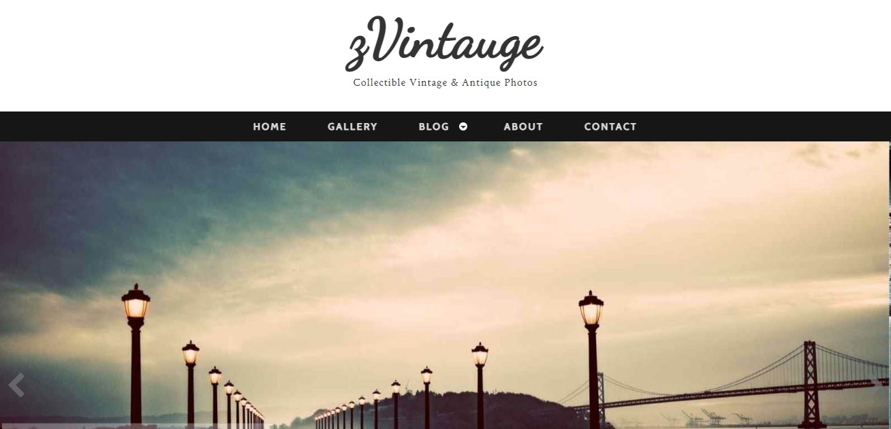

### In this project, I converted a free template prepared with HTML and Css into a react project.

> [live Preview](https://61ddf6eb3923430007251686--sad-hoover-21c4f6.netlify.app)

> [Template Source](https://www.zerotheme.com/2226/zvintauge-free-responsive-html5-template.html)

### Project Screenshot

